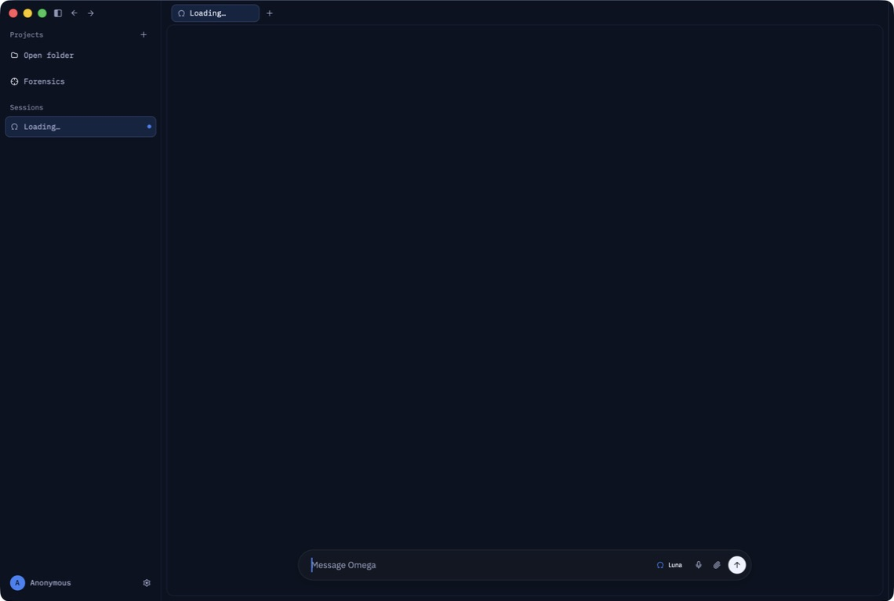

# OAW-002 production navigation acceptance

Date: 2026-08-02

Omega issue [#209](https://github.com/OpenAgentsInc/omega/issues/209)
requires production navigation to expose only implemented, source-backed
destinations. This receipt records the release-fast build, installed-product
inspection, and native render assertions used to close that requirement.

## Result

The installed production surface contains no unimplemented All Work
destination. The Forensics workbench admits Entropy and Lifecycle without a
projection. Case, Evidence, Models, and Publication are absent unless the
corresponding source-backed projection exists. An explicit debug mock or test
support build admits the deterministic fixture scenes and identifies them with
the `DEV MOCKS` label and a `Development mock data` accessibility status.

A persisted fixture-only route normalizes to Entropy when the destination is
not admitted. Candidate and release builds ignore `OMEGA_UI_MOCKS`, including
the value `1`.

## Installed artifact

The application was built with
`OMEGA_PRIMARY_INTERFACE_BUILD=1 script/bundle-mac -f`, packaged as an arm64
release-fast development bundle, ad-hoc signed, and installed at
`/Applications/Omega.app`. The ad-hoc signature is local acceptance evidence;
it is not a notarization or release claim.

The installed app passed `codesign --verify --deep --strict`. Its bundle
identifier was `com.openagents.omega.dev`. The installed executable and the
packaged executable had the same SHA-256 digest:

`0475b4f52bd0c79b53a9b4dfafd83a9ed081b7ee8858ba48966ead53ae5a5f73`

The DMG SHA-256 digest was:

`3a394a54b38d1acd56bfef7ca789a21eaeaaf5d3d0da3b48ec3ca2766140648c`

The installed screenshot captures the production sidebar before OAW-003
renamed its IDE workspace grouping to **Repositories**. It shows the implemented
Forensics entry and no placeholder All Work destinations.

The screenshot SHA-256 digest was:

`68bcfbbbcdf84969d93858e712414b0143201d3403245b27e6b8f4a45390a790`

## Navigation and accessibility proof

`production_and_mock_navigation_expose_exact_accessible_destinations` renders
an actual GPUI window twice and inspects its accessibility tree.

The production render contains these navigation labels:

- `Entropy forensics view`
- `Lifecycle forensics view`

It does not contain these labels:

- `Case forensics view`
- `Evidence forensics view`
- `Models forensics view`
- `Publication forensics view`
- `Development mock data`

The explicit mock render contains all six forensics destinations and the
`Development mock data` status. The same test restores `publication` into the
production scene and verifies that the selected route is Entropy.

The installed app's macOS accessibility inspection exposed the native window,
window controls, and application menus, but it did not expose the GPUI content
tree. The GPUI window render test is therefore the exact content-level
accessibility proof. The installed screenshot is the separate packaged-product
visual proof.

## Verification

- `cargo test -p agent_ui forensics_workbench::tests::`: 22 passed
- `cargo clippy -p agent_ui --release --lib --all-features -- --deny warnings`:
  passed
- `cargo fmt --all -- --check`: passed
- `codesign --verify --deep --strict`: passed for the packaged and installed
  apps
- release-fast package and DMG creation: passed

The repository-wide all-target `./script/clippy -p agent_ui` command still
reports two unchanged test-helper process calls in `agent_panel.rs`. The
warning-denied production-library clippy invocation above covers the changed
production code.
